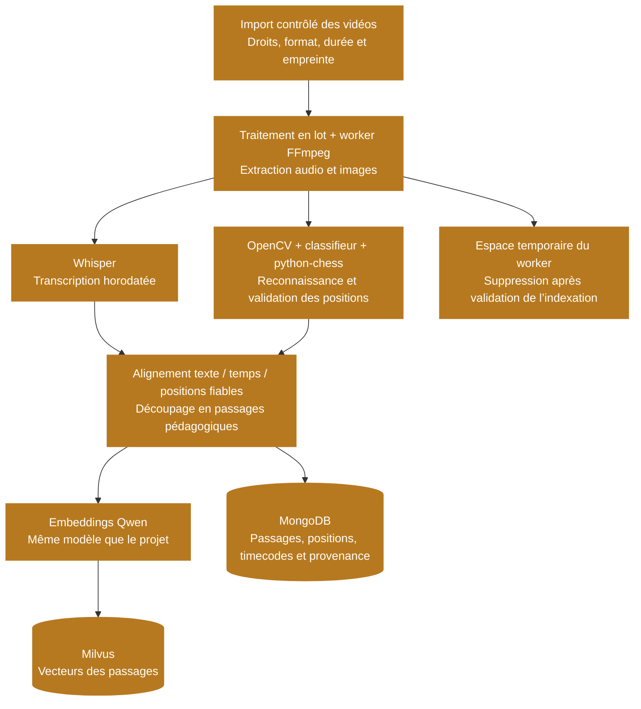
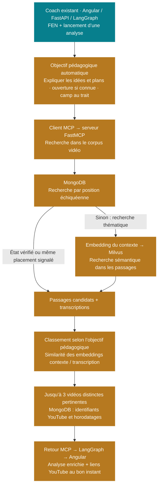
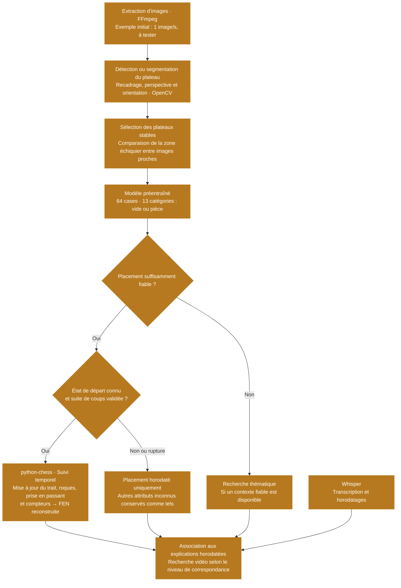
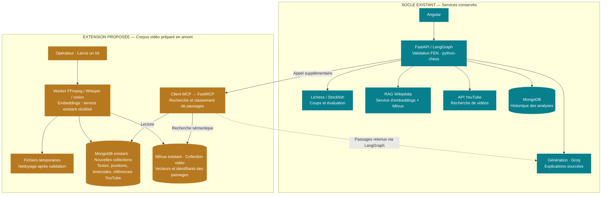
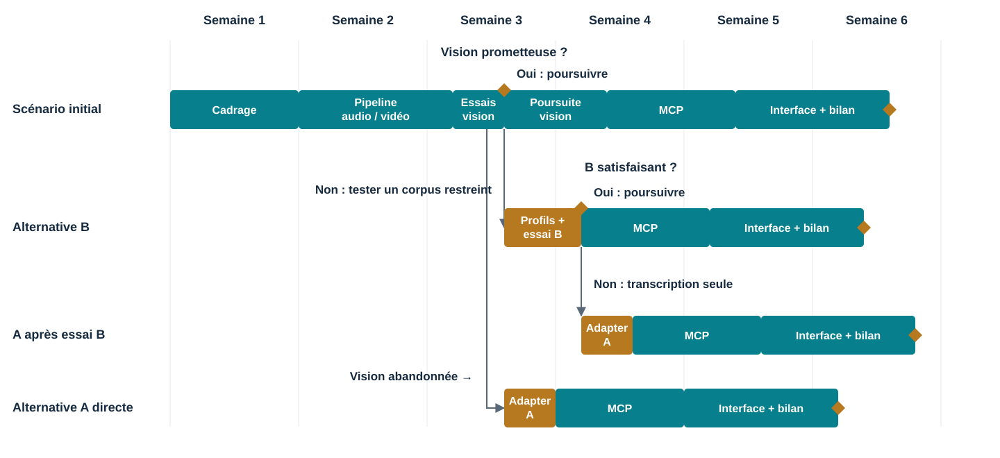

# Étude de faisabilité — Analyse vidéo avancée pour le coach d’échecs

> Projet 13 · Version révisée · 6 octobre 2026
> Conception uniquement : aucune implémentation du système vidéo.

## 1. Analyse vidéo pour le coach d’échecs

**Problématique à résoudre.** Peut-on relier la position jouée par un apprenant à un passage vidéo pertinent, avec un horodatage et une explication vérifiable, pour un coût soutenable ? Cette note propose une extension au POC existant. Elle ne décrit pas une fonctionnalité déjà réalisée.

### Recommandation : un pilote limité, puis une décision

Commencer par des vidéos pédagogiques présentant un échiquier numérique 2D, dont la licence ou l’autorisation du titulaire des droits permet les usages prévus. Tester d’abord des vidéos de créateurs, cadrages et thèmes variés, sans imposer de profils visuels fixes. Si les résultats sont insuffisants, envisager le corpus plus contrôlé de l’alternative B ou la transcription seule de l’alternative A. Combiner transcription horodatée et reconnaissance de positions stables. Utiliser MCP pour exposer des outils spécialisés au graphe LangGraph ; garder les traitements lourds dans des workers asynchrones. Reporter la reconnaissance universelle d’échiquiers physiques 3D à une phase de recherche distincte.

| Repère de décision | Ordre de grandeur / condition |
| --- | --- |
| Pilote de qualité | 20 heures, 40 vidéos de 30 minutes, au moins 5 créateurs, avec des cadrages et thèmes variés |
| Construction de l’extension | 23 à 28 jours-personnes ; 17 250 à 21 000 EUR avec réserve, sans annotation experte |
| Exploitation pilote mensuelle | Environ 134 USD techniques + 1 200 EUR de maintenance |
| Décision de poursuite | Droits acquis et faisabilité sans correction récurrente ; objectifs ultérieurs : précision ≥ 98 %, couverture ≥ 70 %, utilité à mesurer |

**Statut des nombres.** Les budgets, volumes et objectifs ci-dessus sont des hypothèses de planification, pas des mesures du produit. Les tarifs unitaires publiés sont datés et référencés dans le détail budgétaire de la section 1 et les sources de la section 9. Aucun entraînement, benchmark vidéo ni déploiement n’a été réalisé pour cette étude.

<strong>Justification du budget de construction</strong>

**Méthode retenue : une estimation ascendante par lots de travail.** Le total de 23 à 28 jours-personnes est la somme des huit lots ci-dessous. Il ne provient ni d’un benchmark publié ni d’un devis : c’est une estimation préliminaire de charge pour cette étude. Les tâches donnent une base de discussion et de consultation ; elles ne démontrent pas à elles seules que la durée sera suffisante.

**Périmètre POC retenu après revue.** Les charges ci-dessous sont les estimations de travail retenues avec le porteur du projet : démontrer la chaîne de bout en bout et traiter les erreurs évidentes, sans industrialisation. Réutiliser les outils existants, traiter les vidéos en lot avec un worker et permettre une relance manuelle. Les cinq à six jours de vision constituent une enveloppe d’essai de solutions existantes sur des vidéos variées, sans garantie de succès. Un besoin d’entraînement ou d’adaptation importante conduit à choisir une alternative ou à réestimer le lot.

**Hypothèses de périmètre.** L’équipe réutilise le backend, le graphe, les bases et l’interface du POC. Elle maîtrise Python et les outils employés. Elle travaille sur des vidéos 2D, hors direct, avec des modèles et bibliothèques existants, sans entraîner un grand modèle depuis zéro. Les médias sont disponibles avec les permissions nécessaires. Le temps de négociation des accords et les délais d’attente ne sont pas garantis par ces charges.

| Lot estimé | Travail inclus pour justifier le poste | Charge proposée |
| --- | --- | --- |
| Cadrage, droits et protocole | Définir les usages permis, les critères de réussite, le corpus et le protocole d’évaluation | 2–3 jours |
| Préparation du corpus et échantillon de test | Organiser les vidéos, préparer les jeux de développement/test, quelques références de vérification et contrôles, sans outil dédié développé sur mesure | 1–2 jours |
| Pipeline audio/vidéo et jobs | Décoder, transcrire, extraire les images, exécuter un lot hors requête utilisateur, journaliser les erreurs et permettre une relance manuelle | 5–6 jours |
| Vision 2D et validation temporelle | Localiser le plateau, reconnaître les pièces, suivre les images stables et régler les seuils d’abstention | 5–6 jours |
| MCP, recherche et intégration au graphe | Définir les contrats, exposer les outils, indexer les segments et relier leur recherche au workflow | 4–5 jours |
| Interface horodatages et sources | Afficher les passages, leurs sources, les incertitudes et permettre une vérification | 2 jours |
| Évaluation, sécurité et déploiement | Exécuter le protocole, analyser les erreurs, contrôler les accès et vérifier le déploiement | 2 jours |
| Documentation et transfert | Documenter l’architecture, l’exploitation, les limites et les résultats du pilote | 2 jours |
| **Somme** | **Addition des bornes de chaque lot, sans pondération probabiliste** | **23–28 jours-personnes** |

La borne basse suppose peu de difficultés d’intégration et des styles graphiques maîtrisés. La borne haute prévoit davantage de réglages et de corrections, sans couvrir une recherche 3D ou une refonte du POC. **Ce n’est pas un intervalle de confiance statistique.** Pour fiabiliser la charge, il faudra confronter ce découpage à un devis et mesurer un premier traitement complet sur quelques vidéos représentatives.

**Passage de la charge au budget :**

- Développement : **23 × 600 = 13 800 EUR** à **28 × 600 = 16 800 EUR**. Le taux de **600 EUR par jour-personne de 7 heures** est une hypothèse de valorisation uniforme, hors taxes, à remplacer par les coûts réels ou les devis de l’équipe. Il n’est pas présenté comme un tarif de marché vérifié.
- Réserve pour aléas : **25 % du développement**, soit **3 450 à 4 200 EUR**. Ce pourcentage est un choix prudent de planification face aux incertitudes d’intégration ; il n’est pas issu d’une mesure des risques.
- **Aucune prestation d’annotation experte ni correction systématique du corpus n’est prévue.** Une vérification ponctuelle d’un petit échantillon est incluse dans les lots de préparation et d’évaluation déjà chiffrés. Elle sert à tester les sorties, pas à corriger les vidéos pour les rendre utilisables.
- **Total : 13 800 + 3 450 = 17 250 EUR** à **16 800 + 4 200 = 21 000 EUR**.

Le développement seul vaut **13 800 à 16 800 EUR**, et **17 250 à 21 000 EUR avec la réserve de 25 %**. Aucun budget d’annotation supplémentaire n’est ajouté.

Ce total valorise le travail de construction. Il exclut l’exploitation mensuelle et les éventuels achats de droits, faute de devis. Le calendrier et les points de décision figurent en section 8. Pour trois mois d’infrastructure au tarif pilote détaillé en section 1, prévoir séparément environ 402 USD ; cette durée d’exploitation est une hypothèse, pas la durée de développement.

<strong>Justification du budget mensuel du pilote</strong>

**Scénario de calcul.** Le montant annoncé suppose **20 nouvelles heures de vidéo traitées chaque mois**, **1 000 analyses avec recherche vidéo par mois**, une interface et une API disponibles en continu, et un GPU allumé uniquement pendant les traitements. Les 20 heures du corpus de test et les 20 heures mensuelles ont ici la même valeur par choix de scénario ; si le corpus est chargé une seule fois, les coûts d’ingestion ne se répètent pas ainsi chaque mois.

Les tarifs fournisseurs ci-dessous ont été revérifiés le **6 octobre 2026** sur les pages référencées dans la bibliographie. Ils sont distincts des enveloppes sans devis et des hypothèses de consommation. Il ne s’agit pas d’une facture constatée.

| Poste technique | Calcul ou hypothèse pour le pilote | USD/mois |
| --- | --- | --- |
| Hébergement interface/API | 730 h × 0,03 USD/h + abonnement PRO optionnel de 9 USD inclus dans le scénario HF retenu [S9] | 30,90 |
| Bases et sauvegardes | Enveloppe de 60 USD pour l’hébergement persistant ; offre et capacité à confirmer par devis et test de charge | 60,00 |
| Décodage et orchestration CPU | Provision de consommation, sans temps de calcul mesuré | 5,00 |
| Reconnaissance visuelle GPU | 20 h vidéo × 0,25 h de calcul/h vidéo × 0,40 USD/h [S9] ; le ratio de calcul reste à mesurer | 2,00 |
| Transcription | 20 h × 0,04 USD/h [S7] | 0,80 |
| Embeddings | Provision de 1 USD ; tarif exact du modèle et consommation à confirmer [S10] | 1,00 |
| Génération | 1 000 appels × (3 000 tokens d’entrée × 0,075 + 600 tokens de sortie × 0,30) / 1 000 000 [S8], arrondi | 0,41 |
| Opérations et transferts complémentaires | Provision de transferts, sans trafic mesuré | 1,00 |
| Supervision et alertes | Enveloppe provisoire à confirmer selon l’outillage retenu | 10,00 |
| **Sous-total** | **Somme des postes arrondis** | **111,11** |
| **Budget avec réserve de 20 %** | **111,11 × 1,20 = 133,33, arrondi au dollar supérieur à 134** | **134** |

**Stockage retenu.** Aucun archivage durable des vidéos, pistes audio ou images extraites. Chaque worker utilise un espace temporaire borné, provisionné dans l’enveloppe de traitement CPU et à confirmer par mesure. MongoDB conserve les transcriptions, positions horodatées, identifiants et URL YouTube, droits et provenance ; Milvus conserve les vecteurs et identifiants des passages. Les bases et leurs sauvegardes restent payantes. Le disque temporaire se dimensionne selon la taille maximale des fichiers et le nombre de jobs simultanés, et non selon la durée cumulée du corpus. La suppression des médias ne supprime donc pas tous les coûts de stockage.

**Travail humain mensuel, valorisé séparément :**

- Maintenance : **2 jours × 600 EUR = 1 200 EUR**. C’est une provision pour contrôler les traitements, gérer les incidents, mettre à jour les dépendances et vérifier la qualité. Elle ne couvre pas une astreinte permanente et n’est pas issue d’un historique d’exploitation.
- Correction humaine récurrente des vidéos : **non prévue**. Les positions incertaines sont exclues de la recherche exacte ; la transcription peut rester disponible pour une recherche thématique. La couverture sans correction est un critère de faisabilité.
- **Total humain : 1 200 EUR par mois de maintenance**, hypothèse d’exploitation inchangée et distincte du développement du POC.

**Pourquoi deux devises ?** Les fournisseurs sont chiffrés en dollars et le travail humain en euros. Le rapport les conserve séparément pour ne pas introduire de taux de change implicite. Un budget de trésorerie consolidé devra convertir les dollars avec un taux daté et préciser les taxes applicables. **134 USD + 1 200 EUR est donc un scénario budgétaire conditionnel, pas un coût d’exploitation démontré.** Avant validation, les priorités sont un devis d’hébergement des bases, un benchmark du temps GPU et de la couverture sans correction, puis un relevé de consommation des API.

### Ce qui existe et ce qui serait ajouté

<strong>■ Bleu : socle existant réutilisé</strong> 
<strong>■ Orange : traitements à ajouter ou composants à enrichir</strong>

#### A. Ingestion proposée — Préparer le corpus avant les requêtes

*MongoDB conserve les données du corpus : textes, positions, provenance et horodatages. Milvus conserve les embeddings des passages et leurs identifiants pour la recherche sémantique. Les deux bases sont reliées par l’identifiant du passage. Un résultat thématique est signalé comme tel ; en l’absence de résultat fiable ou en cas de panne vidéo, la réponse du coach reste disponible sans cet enrichissement.*

#### B. Consultation proposée — Interroger le corpus et enrichir le coach

## 2. Bénéfices attendus et critères de validation du POC

*Transformer des intentions en critères vérifiables*

Le parcours évalué est celui du bouton Analyser, à partir d’une FEN, sans chat. Aujourd’hui, une vidéo peut traiter la bonne ouverture sans expliquer la position affichée. L’extension vise à réduire ce décalage : indiquer le passage utile, préciser s’il correspond à une position reconnue ou seulement à un thème, et permettre de vérifier le conseil dans sa source.

| Bénéfice attendu | Objectif proposé, non mesuré | Mesure de validation |
| --- | --- | --- |
| Trouver plus vite une explication | Cible : médiane de 5 à 2 min (−60 %), référence initiale à mesurer | Même tâche avec recherche actuelle et recherche horodatée |
| Obtenir un passage pertinent | Au moins 80 % des analyses avec un passage pertinent dans le top 3 | Au moins un passage utile parmi les résultats de 3 vidéos distinctes au maximum |
| Éviter les fausses positions | ≥ 98 % des positions acceptées correctes ; couverture ≥ 70 % sur le corpus initial testé | Précision et abstention mesurées séparément |
| Démarrer au bon instant | ≥ 90 % des liens à ± 5 s du début pertinent de référence | Comparer le début recommandé au passage vérifié dans la vidéo |
| Rester utilisable | p95 recherche < 3 s, explication < 10 s | Corpus déjà indexé ; ingestion exclue de ces délais |

**Lecture des mesures.** Sur un échantillon fixé avant les essais de positions vidéo visibles et vérifiables, la précision est la proportion de placements entièrement corrects (64 cases et orientation) parmi les observations acceptées, et la couverture la proportion d’observations acceptées parmi toutes celles de cet échantillon ; ces mesures ne valident pas à elles seules les droits de roque ou les autres attributs reconstruits.

**Principe de validation.** Fixer ces critères avant les essais pour éviter de les ajuster aux résultats obtenus. Indexer le corpus vidéo, puis lancer le bouton Analyser sur un ensemble de FEN représentatives, incluant des positions présentes et absentes du corpus. Vérifier la pertinence des passages proposés, leur correspondance avec la position, leur horodatage et le temps de réponse. Ce test porte sur le service complet et ne suppose pas d’entraîner un modèle de vision.

**Décision.** Comparer les résultats aux objectifs du tableau et documenter les écarts pour décider de poursuivre, de réduire le périmètre ou de retenir une alternative. Ces valeurs sont des cibles proposées, pas des performances acquises ; la portée des conclusions dépendra du nombre et de la diversité des cas testés.

## 3. Technologies : faisabilité et limites

*Approche à tester : réutiliser des modèles existants, puis suivre les positions dans le temps, sans nouvel entraînement pour le POC.*

### De l’image au passage vidéo exploitable

### Trois niveaux de résultat

| Résultat disponible | Usage dans la recherche vidéo |
| --- | --- |
| **État reconstruit et vérifié** | Correspondance du placement, du trait et des droits pertinents ; la FEN ne contient toutefois pas tout l’historique des répétitions |
| **Placement fiable seulement** | Recherche du même placement, avec mention « état complet non vérifié » ; les possibilités de jeu peuvent différer |
| **Placement incertain** | Recherche thématique si possible, sinon aucun passage proposé |

### Conditions et limites du test

- **Stabilité de l’échiquier, pas de toute la vidéo :** comparer uniquement les plateaux localisés, recadrés et alignés entre images proches. Les gestes du présentateur hors plateau et les bandeaux défilants ne comptent pas. Une main, une flèche ou un texte sur le plateau peut toutefois gêner la reconnaissance, même sans mouvement : stabilité ne signifie pas visibilité suffisante. Une perte du cadrage impose une nouvelle localisation.
- **Diversité du premier essai :** tester plusieurs cadrages et thèmes sans profil fixe imposé. La restriction à des mises en page connues est une solution de repli, décrite dans l’alternative B en section 7, et non un prérequis du scénario initial.
- **Fréquence à tester :** commencer par exemple à une image par seconde, puis examiner davantage d’images autour des changements du plateau si nécessaire. Cet échantillonnage ne garantit pas de capturer chaque coup ni de détecter tous les changements intermédiaires ; en cas de doute, interrompre le suivi de l’état complet plutôt que supposer une continuité.

- **Suivi temporel :** partir d’un état connu, puis appliquer uniquement les coups légaux reliant sans ambiguïté les observations. python-chess actualise les droits de roque, y compris après un mouvement du roi ou d’une tour [S12]. Un saut de variante, un retour arrière ou un coup manqué interrompt la reconstruction ; on ne complète pas les informations manquantes par supposition.
- **Réutilisation à vérifier :** fenify-3D prédit 64 × 13 classes et expose des scores par case [S13]. Le dépôt rapporte 95 % de précision par case en validation et 85,2 % sur son test vidéo [S4] : ce ne sont ni nos mesures ni des taux de FEN exactes. Localisation, orientation et compatibilité avec nos styles restent à tester ; OpenCV assure les transformations géométriques [S3].
- **Alignement audio/image :** le commentaire peut précéder ou suivre le coup. Les horodatages Whisper [S7] permettent l’association, mais une parole transcrite ne suffit pas à valider un mouvement.
- **Périmètre :** les cinq à six jours de vision couvrent un essai sur des vidéos variées avec des outils réutilisables. Un entraînement ou une gestion robuste de toutes les variantes demanderait une nouvelle estimation. L’analyse moteur utilise toujours la FEN valide du joueur.

## 4. Pipeline proposé et modèle de données

*Relier une position analysée à un passage YouTube, sans conserver durablement les médias.*

### A. Alimenter le corpus en amont

| Étape | Traitement proposé | Résultat conservé |
| --- | --- | --- |
| **1. Recevoir le média** | Vérifier les permissions, le format et la durée ; associer le fichier de travail à la bonne vidéo YouTube [S5, S6] | Identifiants, URL, droits, empreinte et version du traitement |
| **2. Extraire et transcrire** | FFmpeg extrait audio et images ; Whisper transcrit et horodate [S7, S11]. Commencer à une image par seconde, fréquence à tester | Texte et horodatages ; fichiers de travail temporaires |
| **3. Reconnaître et suivre le plateau** | Appliquer la démarche de la section 3 : cadrage, stabilité du plateau, reconnaissance et suivi temporel si possible | Placement horodaté ; FEN reconstruite seulement si l’état est connu ; confiance et limites |
| **4. Construire les passages** | Associer explications et positions ; découper par idée ou variante, avec 30 à 90 secondes comme repère à tester | Passages dans MongoDB : texte, début, fin, positions et provenance |
| **5. Indexer puis nettoyer** | Encoder avec le modèle Qwen du projet et écrire dans une collection vidéo Milvus ; vérifier les écritures avant de supprimer les médias temporaires | Vecteurs et identifiants des passages ; état du traitement |

Les positions incertaines sont exclues de la correspondance par position, sans correction humaine systématique. Leur transcription peut rester utilisable pour une recherche thématique. Un fichier source monté différemment de la vidéo YouTube nécessite un réalignement des horodatages avant publication.

### B. Répondre au bouton Analyser

| Étape | Traitement proposé |
| --- | --- |
| **1. Construire le contexte** | Partir de la FEN valide du joueur ; construire l’objectif « expliquer les idées et les plans », avec le camp au trait et l’ouverture si elle est connue. Aucun chat requis |
| **2. Trouver des candidats** | Via l’outil MCP, chercher dans MongoDB un état de jeu vérifié, puis à défaut le même placement avec limites explicites. Sans candidat exploitable, rechercher par sens dans Milvus |
| **3. Classer les passages** | Comparer les embeddings du contexte pédagogique et des transcriptions par similarité cosinus. Le classement Milvus est déjà cette référence pour les candidats sémantiques ; les candidats trouvés par position sont eux aussi classés par leur contenu |
| **4. Proposer les résultats** | Garder jusqu’à trois vidéos distinctes pertinentes, récupérer leurs détails dans MongoDB, puis enrichir la réponse via LangGraph et afficher les liens YouTube horodatés dans Angular |

Distinguer **état vérifié**, **placement seul** et **thème similaire**. Les attributs inconnus ne sont pas inventés ; le score vectoriel n’atteste ni la légalité d’un coup ni la vérité d’une explication. La FEN fournie par le joueur reste celle de l’analyse moteur. Si aucun passage n’est suffisamment pertinent, conserver la réponse du coach sans ajout vidéo. Les seuils seront réglés lors des essais sur des FEN, sans imposer trois résultats faibles. Aucun modèle supplémentaire de reclassement n’est requis pour ce POC.

**Ouverture inconnue.** Construire le contexte thématique à partir de caractéristiques factuelles extraites de la FEN (camp au trait, matériel et emplacement des pièces), puis ne proposer un passage que si sa pertinence est suffisante ; à défaut, conserver l’analyse sans enrichissement vidéo, sans inventer une ouverture ni supposer que l’embedding de la FEN brute suffit.

### Données conservées et correspondances

| Stockage / objet | Identifiants et informations essentiels | Rôle |
| --- | --- | --- |
| MongoDB · Vidéo | `video_id`, `youtube_video_id`, URL, droits, empreinte, version et état du traitement | Relier le média analysé à sa publication YouTube |
| MongoDB · Observation | `position_id`, `video_id`, temps, placement, orientation, attributs connus, FEN si reconstruite, confiance | Retrouver les passages montrant un placement ou un état de jeu |
| MongoDB · Passage | `segment_id`, `video_id`, début, fin, texte, ouverture éventuelle, `position_ids` | Fournir le contenu et l’horodatage du passage |
| Milvus · Vecteur de passage | `segment_id`, embedding, version du modèle et métadonnées de filtrage | Rechercher et classer par proximité de sens |
| Réponse à l’interface | Passage, mode de correspondance, provenance, identifiant/URL YouTube, début et fin | Ouvrir YouTube au début du passage pertinent |

**Lien entre les bases :** `segment_id` relie le résultat Milvus au passage MongoDB ; `video_id` relie ce passage à la vidéo ; `youtube_video_id` permet de construire le lien de lecture avec l’horodatage. Une vidéo peut être associée à plusieurs passages sans créer plusieurs fichiers média.

### Précautions adaptées au POC

- **Publication et nettoyage :** rendre les passages recherchables uniquement après vérification des écritures MongoDB et Milvus, puis supprimer les fichiers temporaires. Les deux bases n’ont pas de transaction commune : garder un état de traitement et contrôler les identifiants lors des relances manuelles pour éviter les doublons. Prévoir aussi le nettoyage des échecs après un délai borné.
- **Disponibilité :** une vidéo YouTube supprimée, privée ou remontée peut invalider le résultat. Signaler ou retirer les passages concernés ; il n’existe pas de copie média durable dans ce scénario.
- **Limite de reprise :** retraiter une vidéo après nettoyage suppose de disposer à nouveau d’une source utilisable. Les files distribuées, le retour arrière automatisé et le basculement atomique entre versions ne sont pas nécessaires au POC.

## 5. Architecture modulaire avec MCP

*Séparer la consultation interactive du traitement préalable des vidéos.*

### Socle existant et extension proposée

| Ensemble | Déjà présent dans le projet | Apport de l’extension vidéo |
| --- | --- | --- |
| Interface et API | Angular, FastAPI et lancement d’analyse à partir d’une FEN | Affichage des passages et liens YouTube horodatés |
| Orchestration et échecs | LangGraph, validation avec python-chess, Lichess et Stockfish | Appel supplémentaire aux outils MCP de recherche vidéo |
| RAG documentaire | Corpus Wikipédia, service d’embeddings et recherche dans Milvus | Même modèle d’embeddings réutilisé ; collection vidéo distincte |
| Vidéos | Recherche de liens via l’API YouTube | Recherche dans un corpus préanalysé pour proposer des passages précis ; la recherche YouTube existante reste distincte |
| Génération | Service de génération via Groq, appuyé sur les sources | Ajout des passages vidéo retenus au contexte documentaire |
| Persistance | MongoDB pour l’historique des analyses | Collections supplémentaires pour vidéos, passages, positions et états d’ingestion |
| Nouveaux composants | — | Client MCP, serveur FastMCP et worker d’ingestion audio/vision |

### Architecture du POC proposée

<strong>■ Bleu : socle existant réutilisé</strong> 
<strong>■ Orange : traitements à ajouter ou composants à enrichir</strong>

*Les blocs MongoDB et Milvus de l’extension représentent de nouvelles données dans les bases existantes, pas de nouvelles instances obligatoires. Les branches du socle résument les responsabilités ; elles n’imposent pas un appel systématique de tous les services pour chaque FEN. L’enrichissement revient à l’interface via le backend existant. La lecture finale reste assurée par YouTube.*

MCP ajoute une interface standard pour les outils vidéo ; il ne remplace pas les services actuels ni les décisions de LangGraph [S1, S2]. L’ingestion est lancée séparément par l’opérateur : le clic du joueur interroge le corpus déjà préparé.

### Déploiement et limites du périmètre

Pour le POC, un seul serveur FastMCP et un worker de traitement en lot suffisent comme architecture de départ. Le client et le serveur peuvent communiquer en Streamable HTTP, avec un accès contrôlé [S2]. Le worker est lancé séparément pour éviter que la reconnaissance vidéo ne fasse partie du temps de réponse au joueur. Si les processus partagent une machine, leurs ressources doivent néanmoins être limitées ou les lots planifiés pour éviter la contention.

Les données MongoDB et Milvus doivent persister et être sauvegardées ; les médias de travail sont temporaires. Seule l’API applicative est accessible depuis le navigateur, pas les ports des bases. MCP standardise les appels aux outils ; il ne remplace ni les décisions de LangGraph, ni le calcul du worker, ni les bases de données.

Le scénario d’hébergement chiffré en section 1 est une hypothèse d’exploitation à confirmer, pas une contrainte de cette architecture. Une file distribuée, plusieurs workers et la haute disponibilité restent hors du POC et demanderaient un dimensionnement ultérieur.

## 6. Contrats MCP et fiabilité

*Définir ce que le coach demande, ce que l’outil retourne et comment gérer un échec.*

### Outils proposés pour la consultation

Un **contrat** décrit les données attendues en entrée et celles renvoyées en sortie. Les outils ci-dessous sont proposés pour l’extension ; ils ne sont pas encore implémentés.

| Outil | Entrées | Sortie et limites |
| --- | --- | --- |
| `search_video_segments` — Rechercher et classer | FEN validée, ouverture éventuelle, contexte pédagogique calculé, nombre de résultats souhaité | Jusqu’à 3 vidéos distinctes : passage, texte, score de pertinence, niveau de correspondance, référence YouTube et horodatages ; aucun traitement vidéo déclenché |
| `get_segment_evidence` — Consulter un passage, si nécessaire | Identifiant d’un passage | Texte, position ou placement connu, provenance et horodatages ; aucune diffusion de fichier média |

La recherche peut renvoyer directement toutes les informations utiles : le second outil est optionnel et n’impose pas un appel supplémentaire pour chaque résultat. FastMCP permet de décrire ces entrées et sorties avec des schémas structurés [S14]. Les outils ne lisent que les passages publiés et utilisables ; une réponse vide est un résultat possible, distinct d’une erreur technique.

### Appel depuis le coach

Au clic sur Analyser, LangGraph construit le contexte à partir de la FEN et de l’ouverture disponible, puis appelle la recherche via le client MCP. Il enrichit le contexte de génération avec les passages retenus et conserve leurs références pour l’affichage. Ce parcours est déterministe : le LLM n’a pas à décider de lancer une ingestion ou de choisir une URL à télécharger. La génération ne transforme pas une correspondance de placement en preuve de légalité d’un coup.

### Erreurs à traiter dans le POC

| Situation | Comportement attendu |
| --- | --- |
| Aucun passage suffisamment pertinent | Conserver l’analyse existante, sans forcer de recommandation vidéo |
| État échiquéen incomplet dans la vidéo | Signaler « placement seul » ou « thème similaire » ; ne pas inventer les attributs manquants |
| Délai dépassé ou recherche vidéo indisponible | Limiter l’attente par un timeout configurable ; afficher l’indisponibilité et conserver l’analyse existante lorsqu’elle est disponible |
| Vidéo YouTube indisponible identifiée | Exclure le passage concerné ou signaler que le lien ne peut plus être utilisé |
| Réponse d’outil mal formée | Refuser les données invalides et journaliser l’erreur, sans transmettre de détail interne à l’utilisateur |

Ce maintien d’une réponse partielle doit être prévu dans l’intégration de l’extension ; il n’est pas présenté comme un comportement déjà vérifié dans l’application actuelle.

### Ingestion indépendante et protections simples

L’opérateur lance le lot d’ingestion séparément. Un worker consigne ses états et erreurs dans MongoDB ; les échecs peuvent être relancés manuellement après vérification des résultats déjà enregistrés. Tester en priorité les fichiers illisibles, les appels de transcription indisponibles, les positions non reconnues et les bases inaccessibles. Aucun outil de lancement d’ingestion n’est nécessaire dans le client MCP utilisé par le coach pour ce POC.

Valider les paramètres des outils, borner le nombre de résultats et contrôler les accès. Si MCP est exposé sur un réseau, prévoir une authentification et un transport protégé adapté ; les bases ne sont pas exposées au navigateur. L’ingestion accepte uniquement les médias approuvés et des tailles et durées bornées. Les transcriptions restent des données documentaires, jamais des consignes autorisant des actions supplémentaires. Les annotations descriptives des outils MCP ne remplacent pas ces contrôles [S14].

La reprise automatique distribuée, une interface d’administration avancée et le lancement des lots via MCP sont des évolutions possibles, hors du périmètre chiffré du POC.

## 7. Risques et alternatives

*Faisabilité conditionnelle, pas promesse universelle*

| Risque / criticité | Réponse proposée et limite résiduelle |
| --- | --- |
| Droits et accès média / haute | Fichiers fournis sous accord écrit ; registre des usages, retrait et suppression des dérivés. Pas de collecte YouTube libre supposée [S5, S6]. |
| FEN erronée / haute | Confiance à calibrer, consensus temporel, contrôle des transitions et abstention. Une position légale peut être mal reconnue. |
| Changement de thème / haute | Test par créateur inédit, mesure de dérive, retour au texte si couverture insuffisante. |
| Déficit de contenu utile / haute | Obtenir au moins 20 h autorisées avant le pilote. Une licence de code ne donne aucun droit sur les vidéos. |
| Coût humain / haute | Aucune correction systématique prévue. Si la couverture utile dépend d’une intervention régulière, réduire le périmètre ou abandonner la vision au profit du texte. |
| Dépendance fournisseur / moyenne | Adaptateurs ASR/LLM, export du corpus, suivi des tarifs et quotas ; prévoir des indisponibilités. |

### Alternative A - Transcription seule et liens horodatés

Indexer uniquement les transcriptions autorisées, l’ouverture et les chapitres. Réutiliser le RAG et MCP sans vision. Avantages : mise en œuvre simplifiée et absence de reconnaissance visuelle, preuve textuelle facile. Limite : impossible de garantir la correspondance avec la position à l’écran. À périmètre POC comparable, retirer le lot vision de 5 à 6 jours donne un premier repère de **18 à 22 jours-personnes**, soit 10 800 à 13 200 EUR avant réserve ; les autres lots restent supposés inchangés.

### Alternative B — Restreindre le corpus à des formats visuels maîtrisables

Cette alternative consiste à privilégier les vidéos pédagogiques avec un **échiquier numérique 2D, lisible et placé de façon stable**, puis traiter les vidéos par lots de profils visuels compatibles. Un profil décrit le cadrage, la résolution, l’orientation et le thème des pièces. Un même créateur peut changer de format : le profil doit donc être vérifié, et non déduit uniquement du nom de la chaîne.

| Choix de cadrage du corpus | Gain attendu, à vérifier | Contrepartie |
| --- | --- | --- |
| Sélectionner des échiquiers numériques vus de face | Réduire les difficultés de perspective et de reconnaissance des pièces | Exclure les échiquiers physiques et certains formats de cours |
| Réutiliser un profil de cadrage sur des vidéos de même mise en page | Éviter de refaire une localisation complexe à chaque image | Détecter un changement de cadrage ou de résolution ; arrêter ou changer de profil |
| Regrouper les thèmes graphiques identiques | Réutiliser le modèle existant, ou tester des gabarits de pièces pour un thème connu | Vérifier l’effet des animations, flèches, surbrillances et compressions |
| Examiner les formats disponibles avant l’ingestion | Réduire les échecs de traitement et mieux maîtriser le POC | Consacrer davantage d’attention au choix du corpus et aux permissions d’utilisation |

**Paramétrer avant d’entraîner.** Un cadrage connu et des pièces de formes répétables peuvent permettre une comparaison à des gabarits, sans entraîner un nouveau modèle. Tester d’abord cette possibilité ou un modèle préentraîné. Entraîner un classifieur spécifique par thème demanderait des exemples, une évaluation et un coût supplémentaire : ce n’est pas inclus automatiquement dans les 5 à 6 jours de vision. Le paramétrage ponctuel d’un profil se distingue d’une correction humaine de chaque vidéo.

**Compromis assumé.** Dans cette alternative, la faisabilité est évaluée sur le corpus compatible, pas sur toutes les vidéos d’échecs de YouTube. Rapporter aussi les vidéos exclues et leurs motifs pour ne pas masquer cette réduction de couverture. Les contenus non pris en charge visuellement peuvent éventuellement rejoindre l’alternative A, avec une pertinence seulement thématique explicitement signalée.

**Impact sur la charge.** Le planning de la section 8 estime un repli précoce vers B : 1 jour de sélection et de préparation des profils, puis 2 jours d’adaptation et de vérification, en remplacement des 4 jours de vision encore disponibles. Le gain net estimé est de 1 jour sur ce parcours. Cette hypothèse suppose un ou deux profils réutilisables, sans nouvel entraînement ; elle reste à confirmer par les essais. Le travail audio, les données et l’intégration sont réutilisés.

Les étapes et les conditions de passage du scénario initial vers ces alternatives sont présentées dans la roadmap de la section 8.

## 8. Roadmap et points de décision

*Tester le scénario initial, puis choisir une suite selon les résultats plutôt que poursuivre à tout prix.*

### Jalons du POC

| Étape | Durée retenue pour le planning | Décision |
| --- | --- | --- |
| Cadrage et corpus | 5 jours | Disposer des médias utilisables et des FEN de test |
| Pipeline audio/vidéo commun | 6 jours | Extraction, transcription et traitement en lot utilisables |
| Premiers essais vision sur quelques vidéos variées | 2 jours | **Jalon au jour 13 : poursuivre la vision variée, essayer B ou passer à A** |
| Suite selon le résultat | Initial : 4 jours ; B : 3 jours ; A : 2 jours | Pour B, décider après ces 3 jours si le corpus restreint est exploitable ; sinon passer à A |
| Intégration et livraison du scénario retenu | 11 jours | MCP : 5 jours ; interface : 2 jours ; évaluation : 2 jours ; documentation : 2 jours |

Le premier jalon intervient après **8 des 12 jours** du bloc pipeline et vision de la borne haute, soit aux deux tiers. Il sert à orienter l’effort, pas à déclarer le POC validé sur deux jours d’essais. La validation complète reste prévue en fin de parcours.

### Parcours de décision dans le planning

### Synthèse des chemins possibles

| Chemin suivi depuis le démarrage | Calcul des jours-personnes | Durée totale | Budget de construction avec réserve |
| --- | --- | --- | --- |
| **Scénario initial** — poursuivre la vision sur corpus varié | 13 + 4 + 11 | **28 jours · 5,6 semaines** | **21 000 EUR HT** |
| **Alternative B** — corpus restreint validé après les premiers essais | 13 + 3 + 11 | **27 jours · 5,4 semaines** | **20 250 EUR HT** |
| **Alternative A après B** — deux essais vision non concluants, puis transcription seule | 13 + 3 + 2 + 11 | **29 jours · 5,8 semaines** | **21 750 EUR HT** |
| **Alternative A directe après les premiers essais** — abandon de la vision sans essai B | 13 + 2 + 11 | **26 jours · 5,2 semaines** | **19 500 EUR HT** |

Calcul : **jours-personnes × 600 EUR × 1,25**, réserve de 25 % comprise, hors exploitation. Le planning représente une personne travaillant cinq jours par semaine, hors délais d’accès aux médias. Les 23 à 28 jours de la section 1 restent l’enveloppe du scénario initial ; les branches utilisent sa borne haute pour comparer les parcours sur une base commune.

Hypothèses de calcul des bifurcations

- **Tronc commun : 13 jours consommés.** Cadrage et corpus (5), pipeline audio/vidéo (6), premiers essais vision (2). La transcription et le pipeline sont réutilisés dans tous les chemins.
- **Poursuite initiale : 4 jours restants de vision.** Avec les 2 jours déjà réalisés, le lot vision conserve sa borne haute de 6 jours. L’essai doit rester borné : si cette enveloppe ne suffit pas, réestimer ou changer de périmètre.
- **B : 3 jours supplémentaires estimés.** Une journée pour sélectionner les formats compatibles et préparer un ou deux profils visuels ; deux jours pour adapter le recadrage ou les gabarits et vérifier reconnaissance et suivi sur ces formats. Ces 3 jours **remplacent les 4 jours de vision restants**, au lieu de s’ajouter à un lot initial entièrement consommé. Le gain net estimé est donc d’un jour, sans nouvel entraînement. Un grand nombre de profils invaliderait cette hypothèse.
- **A : 2 jours d’adaptation estimés.** Retirer la dépendance aux observations visuelles, vérifier les passages issus des transcriptions et préparer leur classement thématique. Cette charge ne recommence ni la transcription ni l’intégration MCP. Après un échec de B, ses 3 jours restent consommés.
- **Travail final commun : 11 jours.** L’intégration MCP, l’interface, les essais de bout en bout et la documentation restent à réaliser quelle que soit la branche. Aucun gain non démontré n’est déduit de ces lots.
- **Portée des montants.** Ce sont des estimations conditionnelles de tâches, pas des durées mesurées ni des plafonds garantis. Le budget de B choisi dès le départ n’est pas celui de B après les essais initiaux. Une économie supplémentaire est possible si les formats contrôlés simplifient davantage le travail ; elle reste à mesurer.
- **Bilan final.** Valider le périmètre effectivement démontré si ses critères applicables sont atteints ; sinon réviser ou arrêter. Une réussite sur B ne valide pas la couverture du corpus initial ; A ne prétend pas reconnaître les positions.

## 9. Sources

*Références utilisées dans le rapport*

Les références web conservées ont été revérifiées le **6 octobre 2026**. La spécification MCP citée est une version datée, utilisée pour les principes d’architecture, sans la présenter comme la dernière version du protocole. Les coûts sont un budget d’étude, pas une offre ferme. Les performances citées de fenify-3D appartiennent à son auteur. Les objectifs du pilote sont nos propositions. Aucun test vidéo n’a été réalisé dans le cadre de cette note.

- **[S1]** [MCP - Architecture hôte / client / serveur](https://modelcontextprotocol.io/specification/2025-06-18/architecture). Rôles et séparation des responsabilités.

- **[S2]** [FastMCP - Déploiement HTTP](https://gofastmcp.com/deployment/http). Transport Streamable HTTP et déploiement ; figer une version stable lors du développement.

- **[S3]** [OpenCV - Transformations géométriques](https://docs.opencv.org/4.13.0/da/d54/group__imgproc__transform.html). Rectification perspective et transformation de coordonnées.

- **[S4]** [notnil / fenify-3D - README et résultats](https://github.com/notnil/fenify-3D). Précision par case et différence de distribution validation/test.

- **[S5]** [YouTube Data API - Captions: download](https://developers.google.com/youtube/v3/docs/captions/download). Permission de modifier la vidéo requise ; coût de 200 unités par appel.

- **[S6]** [YouTube - Developer Policies, section III.E.1](https://developers.google.com/youtube/terms/developer-policies). Restrictions sur téléchargement et stockage du contenu audiovisuel.

- **[S7]** [Groq - Speech to Text](https://console.groq.com/docs/speech-to-text). Whisper large v3 turbo : 0,04 USD/h ; horodatages disponibles.

- **[S8]** [Groq - Supported Models](https://console.groq.com/docs/models). GPT OSS 20B : 0,075 USD entrée / 0,30 USD sortie par million de tokens.

- **[S9]** [Hugging Face - Spaces et tarifs](https://huggingface.co/pricing). CPU upgrade 0,03 USD/h ; T4 small 0,40 USD/h ; PRO 9 USD/mois.

- **[S10]** [Hugging Face - Inference Providers pricing](https://huggingface.co/docs/inference-providers/pricing). Facturation des fournisseurs ; enveloppe embeddings à mesurer.

- **[S11]** [FFmpeg - Filters documentation](https://ffmpeg.org/ffmpeg-filters.html). Sélection et traitement des images ; décodage à dimensionner.

- **[S12]** [python-chess - Core](https://python-chess.readthedocs.io/en/latest/core.html). FEN, statut de validité et représentation de l’état échiquéen.

- **[S13]** [fenify-3D - prediction.py](https://raw.githubusercontent.com/notnil/fenify-3D/main/prediction.py). Lecture du chemin d’inférence et des scores par case.

- **[S14]** [FastMCP - Tools](https://gofastmcp.com/servers/tools). Schémas d’entrée et de sortie, annotations descriptives et gestion des erreurs.
